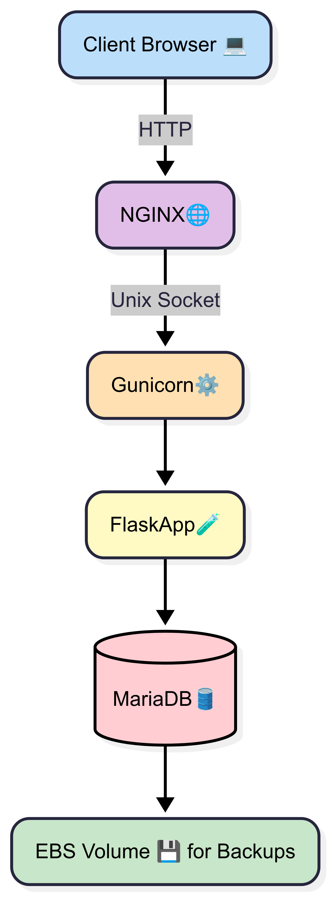
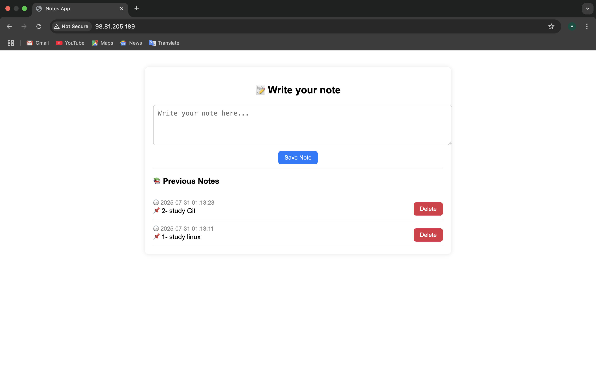

# 📘 Notes App - Flask + MariaDB on EC2 (RHEL 9)

This project is a **Note-Taking Web Application** built using **Flask** (Python) and **MariaDB**, deployed on a **RHEL 9 EC2 instance**. The app is served using **Gunicorn** and **NGINX**, with a backup strategy that stores database dumps in an attached **EBS Volume**.

---

## 🚀 Features

* Add and store notes in a database
* Auto timestamp for each note
* Flask-based simple web interface
* MariaDB for data persistence
* NGINX reverse proxy with Gunicorn app server
* Backup strategy using EBS volume and bash script
* Systemd service to auto-start Gunicorn on reboot

---

## ⚙️ Tech Stack

* **Backend:** Python (Flask)
* **Database:** MariaDB
* **Web Server:** NGINX
* **WSGI Server:** Gunicorn
* **OS:** RHEL 9 (or similar Linux distro)
* **Deployment:** Manual on AWS EC2

---

## 🏗️ Project Structure

```
notes-app (in /var/www/notes-app)
├── app.py                # Main Flask Application
├── backup.sh             # MariaDB Backup Script
├── requirements.txt      # Python Dependencies
├── LICENSE               # MIT License for project usage and distribution
├── README.md             # Project Documentation
├── .gitignore            # Git ignored files
│
├── notes-app.service     # systemd service file (in /etc/systemd/system/)
│
└── notes-app.conf        # NGINX Configuration (in /etc/nginx/conf.d/)

```


---

## 🧠 Project Architecture

```
+---------+      HTTP      +--------+       Unix Socket       +-------------------------+        SQL         +----------+
|  Client |  <---------->  | NGINX  |  <--------------------> |         Gunicorn        | <--------------->  | MariaDB  |
+---------+                +--------+                         | [Flask App (port 5000)] |                    +----------+
                                                              +-------------------------+
                                                                          │
                                                                          ▼
                                                              +-------------------------+
                                                              |     EBS Volume for      |
                                                              |   DB Backups (/backup)  |
                                                              +-------------------------+
```


---

## 🔧 Setup Steps

### 1. Connect to EC2

```bash
chmod 400 your-key.pem
ssh -i your-key.pem ec2-user@your-ec2-public-ip
```

---

### 2. Install & Update System Packages

```bash
sudo dnf update -y
```

```bash
sudo dnf install -y git
sudo dnf install -y wget
sudo dnf install -y curl
sudo dnf install -y python3
sudo dnf install -y python3-pip
sudo dnf install -y python3-devel
sudo dnf install -y nginx
sudo dnf install -y mariadb-server
sudo dnf install -y mariadb
```
or 
```bash
sudo dnf install -y git wget curl python3 python3-pip python3-devel nginx mariadb-server mariadb
```

---

### 3. Start & Secure MariaDB

```bash
sudo systemctl start mariadb
sudo systemctl enable mariadb
sudo systemctl status mariadb
sudo mysql_secure_installation
```

Follow prompts to:

* Set or change root password
* Remove anonymous users

---

### 4. Install Python Packages

```bash
sudo dnf install -y mariadb-connector-c-devel
sudo dnf groupinstall "Development Tools" -y
sudo pip3 install flask
sudo pip3 install flask-mysqldb
sudo pip3 install mariadb
sudo pip3 install gunicorn
```

### Install Python MySQL Connectors

```bash
sudo pip3 install mysql-connector-python flask-mysqldb
pip3 list | grep -E 'mysql|flask'
```

### Test MariaDB Driver for Python

Test MariaDB module:

```bash
python3 -c "import mariadb; print('Mariadb module is working ✅')"
```

---

### 5. Create Project Directory & Files

```bash
cd /usr/share/nginx/html
rm index.html
sudo mkdir /var/www/notes-app/
cd /var/www/notes-app
sudo vi app.py
sudo vi requirements.txt
```

Inside`requirements.txt`:

```txt
flask
mariadb
gunicorn
```

---

### 6. Prepare MariaDB Database

### To Enter MariaDB Database
```bash
sudo mysql -u root -p
```
or
```bash
sudo mysql
```

```sql
CREATE DATABASE notesdb;
DROP USER IF EXISTS 'noteuser'@'localhost';
CREATE USER 'noteuser'@'localhost' IDENTIFIED BY 'notepassword';
GRANT ALL PRIVILEGES ON notesdb.* TO 'noteuser'@'localhost';
FLUSH PRIVILEGES;
EXIT;
```

---

### 7. Create Notes Table

```bash
sudo mysql -u root -p
```

```sql
USE notesdb;
CREATE TABLE notes (
    id INT AUTO_INCREMENT PRIMARY KEY,
    content TEXT NOT NULL,
    created_at TIMESTAMP DEFAULT CURRENT_TIMESTAMP
);
EXIT;
```

---

### 8. Test DB Connection from Python

Test Connection:
```bash
python3 -c "
import mariadb;
conn = mariadb.connect(user='noteuser', password='notepassword', host='localhost', database='notesdb');
print('Connection is successful!');
conn.close()"
```

---

### 🌍 Start & Configure NGINX + Test Configure (Front-end Server)

```bash
sudo systemctl start nginx
sudo systemctl enable nginx
sudo systemctl status nginx
sudo vi /etc/nginx/conf.d/notes-app.conf
```

```nginx
server {
    listen 80;
    server_name _;

    location / {
        proxy_pass http://127.0.0.1:5000;
        proxy_set_header Host $host;
        proxy_set_header X-Real-IP $remote_addr;
        proxy_set_header X-Forwarded-For $proxy_add_x_forwarded_for;
        proxy_set_header X-Forwarded-Proto $scheme;
    }
}
```

Test and Restart NGINX:

```bash
sudo nginx -t
sudo systemctl restart nginx
```

### Fix NGINX access to app port (SELinux)

To Fix SELinux Use Command [Allow NGINX to Access App Port]:

```bash
sudo setsebool -P httpd_can_network_connect 1
```

---

### 🔥 Run App with Gunicorn

```bash
cd /var/www/notes-app
find / -name gunicorn 2>/dev/null   # Find gunicorn path if needed
ps aux | grep gunicorn
pkill gunicorn 
/usr/local/bin/gunicorn --bind 127.0.0.1:5000 app:app --chdir /var/www/notes-app --daemon              # Run the app in background:
```
### Troubleshoot Port Usage
```bash
sudo dnf install -y lsof
sudo lsof -i :5000
sudo kill -9 <PID>
``` 
---

### ✅ Confirm Everything is Working

```bash
curl http://127.0.0.1:5000          # Should return HTML form
curl -I http://localhost            # Should return HTTP 200 OK
```

Open your EC2 public IP in browser, app should load.

---

### 🔁 Auto Start App with systemd 

```bash
sudo vi /etc/systemd/system/notes-app.service
```

```ini
[Unit]
Description=Gunicorn instance to serve notes-app
After=network.target

[Service]
User=ec2-user
Group=nginx
WorkingDirectory=/var/www/notes-app
ExecStart=/usr/local/bin/gunicorn --bind 127.0.0.1:5000 app:app

[Install]
WantedBy=multi-user.target
```

Enable and Start the Service:

```bash
sudo systemctl daemon-reexec
sudo systemctl daemon-reload
sudo systemctl enable notes-app
sudo systemctl start notes-app
```

---

## 💽 Backup Strategy

### 1. Create & Mount External EBS Volume

```bash
lsblk
sudo fdisk /dev/xvdb
sudo mkfs.ext4 /dev/xvdb1
sudo mkdir /backup
sudo mount /dev/xvdb1 /backup
```

### 2. Add to /etc/fstab for auto mount:

```bash
sudo blkid /dev/xvdb1  # To know Partition UUID
sudo vi /etc/fstab
```

```
UUID=<your-uuid>   /backup   ext4    defaults    0   0
```

### 3. Create Backup Script

```bash
sudo vi /var/www/notes-app/backup.sh
```

```bash
#!/bin/bash
DATE=$(date +%F_%T)
mysqldump -u noteuser -pnotepassword notesdb > /backup/notes_backup_$DATE.sql
```

```bash
sudo chmod +x /var/www/notes-app/backup.sh
/var/www/notes-app/backup.sh
ls /backup
```

---

## ✅ Done!

Your Notes App is live and backed up! 🎉

## 📸 Demo

Here’s a preview of the Notes App:



---

## 📬 Author

- **Name:** Aya Elhwary  
- **Track:** DevOps  
- **Email:** elhwarya810@gmail.com 

---

## 📄 License

This project is licensed under the [MIT License](./LICENSE).

---
## Note
To can upload images from your device to server

- In terminal on my device, not inside server: 

```bash
scp -i ~/Downloads/app.pem ~/Downloads/project-structure-diagram.png ec2-user@<EC2-IP>:/home/ec2-user/
```
- Connect to server and move images to /var/www/notes-app/images/:

```bash
ssh -i ~/Downloads/app.pem ec2-user@<EC2-IP>
sudo mv /home/ec2-user/<Image-Name> /var/www/notes-app/images/
```
---
